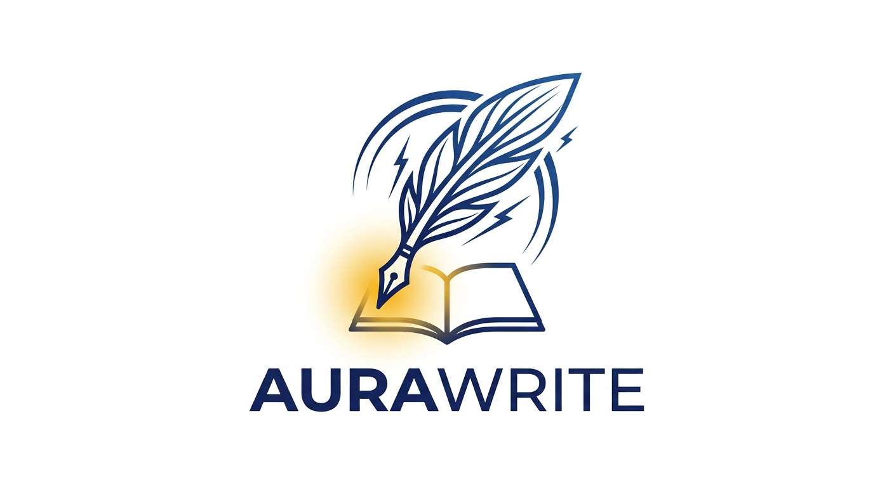

<h1 align="center">
  
  &nbsp;AuraWrite
</h1>

<p align="center">
  <strong>Local. Libre. Life-long.</strong> 🌙
</p>

<p align="center">
  <em>Where lightning meets the page.</em>
</p>

<p align="center">
  <a href="#-quick-start"></a>
  <a href="#-installation"></a>
  <a href="#-privacy"></a>
  <a href="LICENSE"></a>
  <a href="https://www.patreon.com/c/PatataLab"></a>
  <a href="https://buymeacoffee.com/patatalab"></a>
</p>

<p align="center">
  
  
  
  
  
  
</p>

---


---

## 🌙 Why AuraWrite?

**AuraWrite channels lightning.**

> *"The electric lamp may indeed be ignored, for the simple reason that it is so insignificant and transitory. And anyway, it is certain that fairy-stories have much more permanent and fundamental things to talk about. The lightning, for instance."*
> — J.R.R. Tolkien

Modern technology — including AI — does not replace the human; it supports him. The light of technology is like the electric lamp: useful, but transient. The imagination of the human soul is like lightning: vast, untamed, fundamental.

AuraWrite exists to channel that lightning. A spark of an idea, caught in the right moment, guided by the right tool, can become something that outlasts us.

**What you get:**

- ⚡ **ProseMirror-powered editor** — Professional-grade rich text editing
- 🤖 **Dual AI panels** — Proactive suggestions + conversational assistant
- 🔒 **100% offline capable** — Your data never leaves your machine
- 🎨 **Custom themes** — Light, Dark, and fully personalized color schemes
- 🗄️ **Multiple formats** — JSON, Markdown, TXT, HTML, DOCX
- ♾️ **Life-long** — Download once, use forever. No cloud to cancel.

---

## 🚀 Quick Start

### Option 1: Pre-built Executables (Recommended)

Download ready-to-run binaries from the [Releases](https://github.com/ACarloGitHub/AuraWrite/releases) page:

| Platform | File | Notes |
|----------|------|-------|
| **Linux** | `.deb` or `.rpm` | x86_64 |
| **Windows** | `.msi` or `.exe` | x86_64, portable |
| **macOS** | `.dmg` | x86_64/ARM64, unsigned |

```bash
# Linux example
sudo dpkg -i aurawrite_0.1.0_amd64.deb
aurawrite
```

### Option 2: Build from Source

**Prerequisites:**

| Tool | Required | Install |
|------|----------|---------|
| **Node.js 18+** | Yes | [nodejs.org](https://nodejs.org/) |
| **Rust stable** | Yes | [rustup.rs](https://rustup.rs/) |
| **Tauri CLI v2** | Yes | `cargo install tauri-cli --version "^2"` |

**Build:**

```bash
git clone https://github.com/ACarloGitHub/AuraWrite.git
cd AuraWrite
npm install
npm run tauri:dev      # Dev mode
npm run tauri:build    # Production build
```

---

## ✨ Features

| Feature | Description | Status |
|---------|-------------|--------|
| **📝 Rich Text Editor** | ProseMirror-based with bold, italic, undo/redo | ✅ Ready |
| **🤖 AI Suggestions Panel** | Proactive sentence analysis triggered on "." | ✅ Ready |
| **💬 AI Assistant Panel** | Conversational AI with full document context | ✅ Ready |
| **🧩 Chunk System** | Handles large documents via intelligent splitting | ✅ Ready |
| **🌐 Multi-Provider AI** | Ollama (local), OpenAI, Anthropic | ✅ Ready |
| **💾 File Operations** | Save, Save As, Open, Export with native dialogs | ✅ Ready |
| **📄 Multiple Formats** | JSON, Markdown, TXT, HTML, DOCX | ✅ Ready |
| **🎨 Custom Themes** | Light, Dark, and fully customizable colors | ✅ Ready |
| **🔒 Privacy-First** | Works offline, no telemetry, no tracking | ✅ Ready |
| **📊 Incremental Save** | Versioning system with database | 📅 Roadmap |
| **🗄️ Vector DB** | Semantic search across documents | 📅 Roadmap |
| **🤖 Internal AI Agent** | Character/world memory, continuation | 📅 Future |

**Tech Stack:**
- **Frontend:** TypeScript, Vite
- **Editor:** ProseMirror
- **Backend:** Rust (Tauri)
- **UI:** Plain CSS, HTML5
- **AI Integration:** Ollama API, OpenAI API, Anthropic API

---

## 🤖 AI Configuration

AuraWrite supports multiple AI providers. Configure in the app's settings panel (⚙️).

### Ollama (Local)
For local models running on your machine:
1. Install [Ollama](https://ollama.ai/)
2. Pull a model: `ollama pull llama3`
3. In AuraWrite settings:
   - **Provider:** Ollama
   - **Model:** `llama3` (or your preferred model)

**Common Ollama models:**
- `llama3` — General purpose, good balance
- `llama3.1` — Updated version with longer context
- `mistral` — Fast and efficient
- `qwen2.5` — Good for creative writing
- `phi3` — Smaller, faster model

### Ollama (Cloud / Custom Endpoint)
For remote Ollama instances:
- **Provider:** Ollama
- **Model:** `model-name`
- **Base URL:** `http://your-server:11434`

### OpenAI
1. Get an API key from [OpenAI](https://platform.openai.com/api-keys)
2. In AuraWrite settings:
   - **Provider:** OpenAI
   - **Model:** `gpt-4o` (or `gpt-4o-mini`, `gpt-4-turbo`)
   - **API Key:** `sk-...`

### Anthropic
1. Get an API key from [Anthropic](https://console.anthropic.com/)
2. In AuraWrite settings:
   - **Provider:** Anthropic
   - **Model:** `claude-sonnet-4-20250514`
   - **API Key:** `sk-ant-...`

### Privacy Note
AI settings are stored in browser's `localStorage` as `aurawrite-ai-settings`. They persist across sessions and are **NEVER uploaded or shared**.

### Chunk Size
For long documents, AuraWrite automatically splits text into chunks based on the model's context limit. Default: 8,000 tokens per chunk. Adjustable in AI Assistant panel settings.

---

## 💾 Data Storage

Documents stored locally:
```
Linux:   ~/.config/aurawrite/
Windows: %APPDATA%\aurawrite\
macOS:   ~/Library/Application Support/aurawrite/
```

**Backup:** Export to JSON, Markdown, or DOCX anytime. Your data, your control.

---

## 🗺️ Roadmap

| Phase | Feature | Status |
|-------|---------|--------|
| ✅ **v0.1** | Editor, AI panels, File operations | Complete |
| 🚧 **v0.2** | SQLite + Vector DB, Incremental save | In Progress |
| 📅 **v0.3** | Tooltip plugin, Synonyms, Continuation | Planned |
| 📅 **v0.4** | Character/place memory, Internet search | Planned |
| 🎁 **v1.0** | Plugin system, Polish | Future |

See detailed roadmap in [documentation/06-roadmap/](documentation/06-roadmap/).

---

## 🤝 Contributing

Contributions are welcome! See [CONTRIBUTING.md](CONTRIBUTING.md) for guidelines.

When opening issues:
- Your OS and version
- Node.js and Rust versions
- Steps to reproduce
- Error messages

---

## 🙏 Acknowledgments

**AuraWrite** was born from an idea by **Carlo** and developed through **vibecoding** with:
- [OpenCode](https://github.com/opencode-ai/opencode) — AI coding assistant
- [MiniMax M2.7](https://www.minimaxi.com/) — AI model
- [Ollama Cloud](https://ollama.com/) — Local AI infrastructure

This represents Carlo's most solid and fulfilling development system to date — a human idea, amplified by AI, grounded in local-first principles.

Special thanks to the open-source communities behind **Tauri**, **ProseMirror**, and **Rust**.

---

## 📄 License

Copyright © 2026 AuraWrite — **MIT License**

```
MIT License

Copyright (c) 2026 Carlo / PatataLab

Permission is hereby granted, free of charge, to any person obtaining a copy
of this software and associated documentation files (the "Software"), to deal
in the Software without restriction, including without limitation the rights
to use, copy, modify, merge, publish, distribute, sublicense, and/or sell
copies of the Software, and to permit persons to whom the Software is
furnished to do so, subject to the following conditions:

The above copyright notice and this permission notice shall be included in all
copies or substantial portions of the Software.

THE SOFTWARE IS PROVIDED "AS IS", WITHOUT WARRANTY OF ANY KIND, EXPRESS OR
IMPLIED, INCLUDING BUT NOT LIMITED TO THE WARRANTIES OF MERCHANTABILITY,
FITNESS FOR A PARTICULAR PURPOSE AND NONINFRINGEMENT. IN NO EVENT SHALL THE
AUTHORS OR COPYRIGHT HOLDERS BE LIABLE FOR ANY CLAIM, DAMAGES OR OTHER
LIABILITY, WHETHER IN AN ACTION OF CONTRACT, TORT OR OTHERWISE, ARISING FROM,
OUT OF OR IN CONNECTION WITH THE SOFTWARE OR THE USE OR OTHER DEALINGS IN THE
SOFTWARE.
```

**AuraWrite will never become a paid product or require subscription.** The MIT License guarantees this remains **free and open source forever.**

---

<p align="center">
  <strong>Local. Libre. Life-long.</strong> 🌙
</p>
